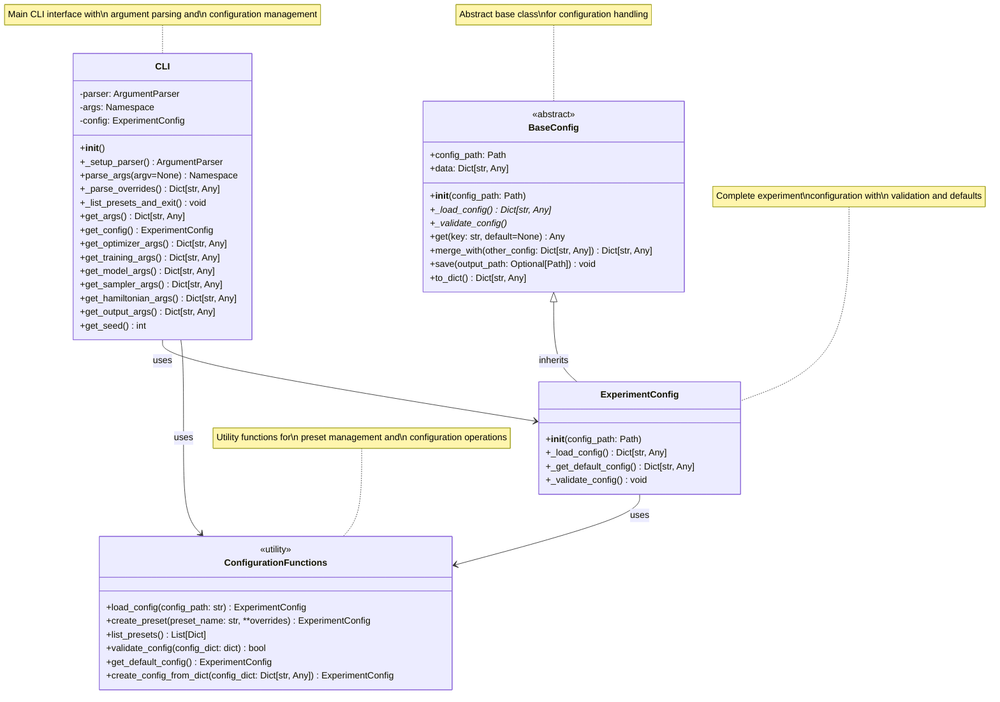
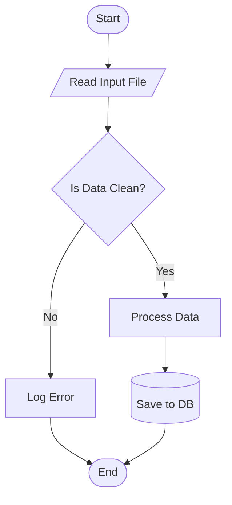

# qvarnet: A package to simulate quantum systems via VMC with Artificial Neural Networks ansatzë

### Installation

To install the conda environment, from the root directory of the project run:

```bash
conda env create -f environment_config.yaml
```

and activate with

```bash
conda activate jax
```

Finally, from the root directory of the project, the package must be installed in edit mode:

```bash
pip install -e .
```

### Execution

From the root folder, run

```bash
qvarnet run [>output.txt]
```

The parameters are found inside `./src/qvarnet/cli/parameters`

The [] option is recommended if there are prints in the code. The progressbar is still displayed in the terminal

# WIP: Diagrams

## Class Diagram




Flowchart Diagram

